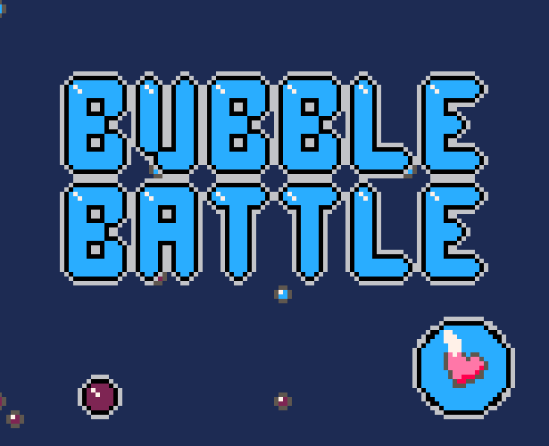
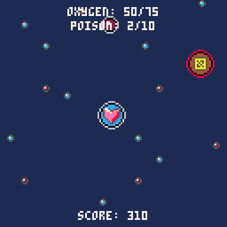
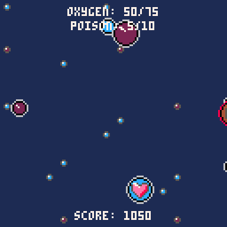

# Bubble Battle

This second little PICO-8 game was created for the Mini Jam 84: Bubbles.

## About the game:

In this game you play the heart that is kept alive in the sea by an oxygen bubble. To survive you have to collect oxygen. Watch out: dangers lurk in the water like dangerous poisons and bombs. Avoid or destroy them with the help of your oxygen, which can serve as ammunition!

 

During the entire duration of the game, your freedom of movement is restricted by a single accessible area in the water. Will you survive?

Unlockable achievements are integrated in the game for even longer fun in the game.

Play it now on [itch.io](https://peanutsfly.itch.io/bubble-battle) or the [Lexaloffle Forum](https://www.lexaloffle.com/bbs/?tid=44107).

The [PICO-8 Fantasy Console](https://www.lexaloffle.com/pico-8.php) is required to compile the game yourself.

## How to play:

-   Start your game by pressing X/C.
-   Move your character with the arrow keys.
-   Fire oxygen with X/C.
-   Collect oxygen to survive and to gain ammunition.
-   Avoid poison and bombs.
-   Pay attention to your oxygen and poison limits!

For the best gaming experience, you should play the game in full screen (on the browser) or locally (see downloads) on the PC!

## Credits:

-   Music: Into the Belt and Robot Dance by @gruber_music
-   Art, Programming, Sounds: Made by Peanutsfly

## Additional Information:

-   Status: Released
-   Platforms: Windows, macOS, Linux, HTML5
-   Author: PeanutsFly
-   Genre: Action
-   Made with PICO-8, Aseprite
-   Tags: 2D, Arcade, Casual, Endless, PICO-8, Pixel Art, Retro, Short, Singleplayer
-   Average session: A few minutes
-   Languages: English
-   Inputs: Keyboard
